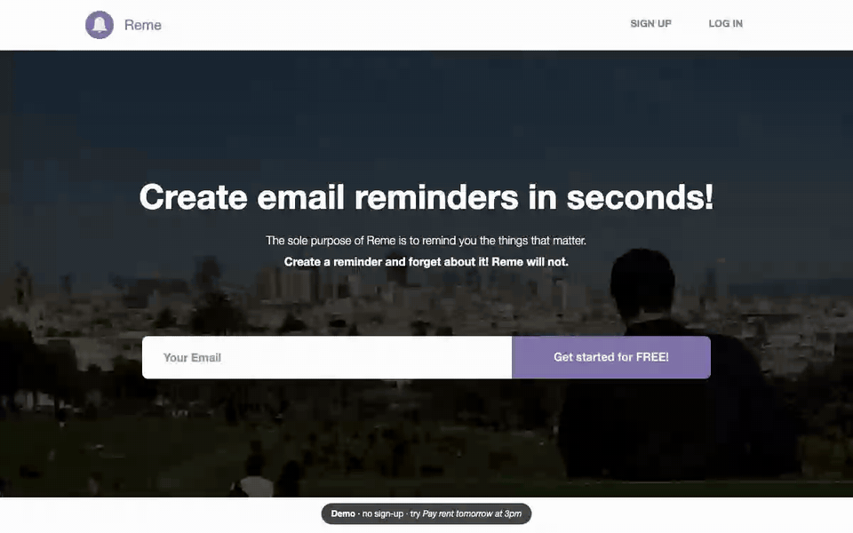
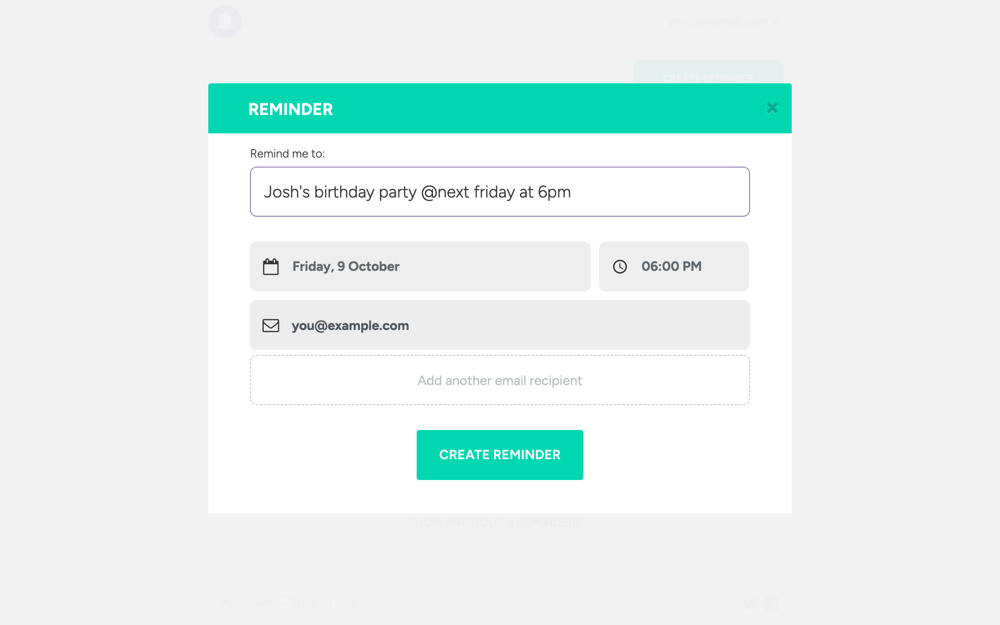
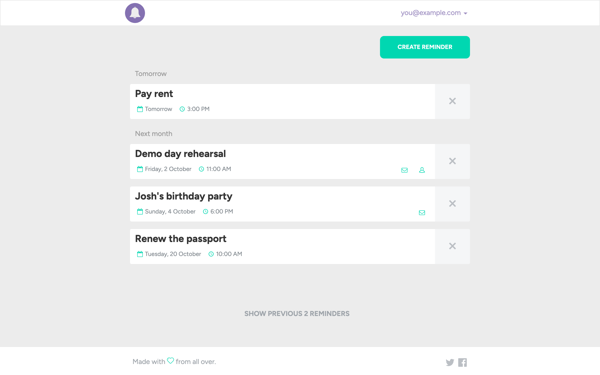
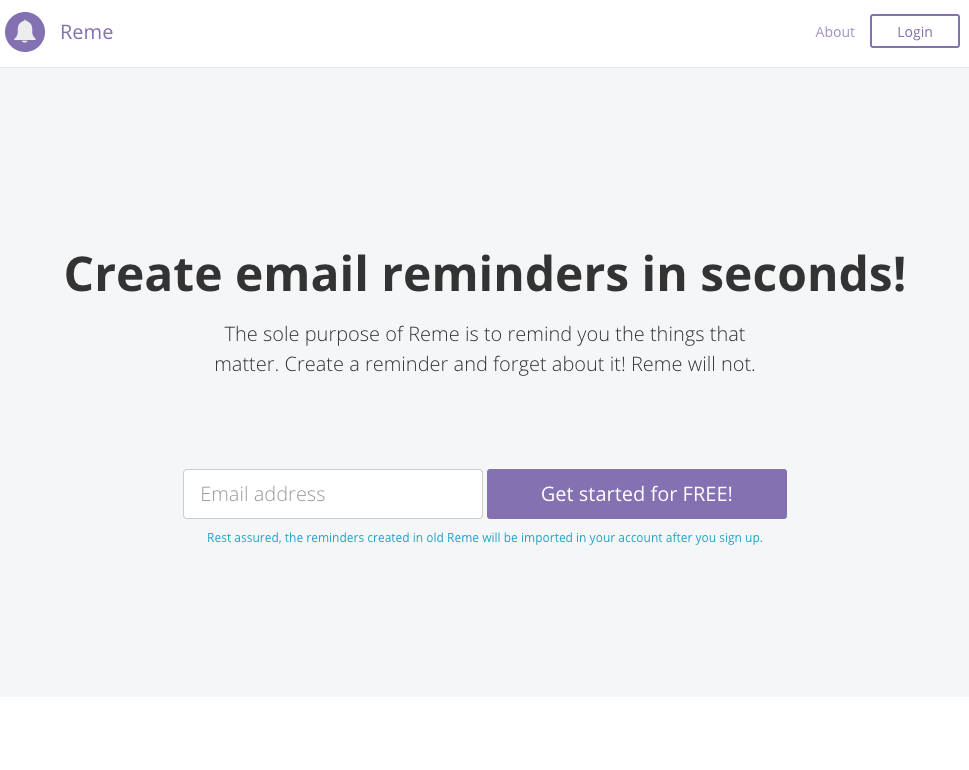

<div align="center">


# Reme

**Natural-language reminders, years before typing to software was normal.**

Type _"Pay rent @tomorrow at 3pm"_ and Reme e-mails you on time. There was no form to fill in: the sentence was the interface. A small team built it and ran it on reme.io from 2014. It was revived in 2026 so it runs again, entirely in your browser.

[](https://github.com/ioanlucut/reme/actions/workflows/ci.yml)
[](https://ioanlucut.github.io/reme/)


[](LICENSE)

<a href="https://ioanlucut.github.io/reme/"></a>

**[Try the live demo →](https://ioanlucut.github.io/reme/)** No sign-up needed.

</div>

## What Reme does

The whole product is one idea: **a reminder should take less time to write than to forget.**

1. **You write the reminder the way you'd say it.** Everything before the `@` is what to remember, and everything after it is when. The date and time pickers update as you type, and you can still adjust them by hand. [How it reads a sentence](#talking-to-software-in-2014) is below.
2. **Reme e-mails you when it's due.** The reminder is scheduled in the timezone of the browser it was written in.
3. **You can remind other people too.** Add more recipients and they get the email as well. They see the reminder in their own list and can unsubscribe from it.
4. **Your reminders stay organised.** They're grouped as _Today_, _Tomorrow_, _This month_, _Next month_ and so on, with upcoming and past reminders kept apart.

<table>
<tr>
<td width="50%"></td>
<td width="50%"></td>
</tr>
<tr>
<td><sub>The date and time are parsed from the text as you type.</sub></td>
<td><sub>Upcoming reminders, grouped by when they're due.</sub></td>
</tr>
</table>

## Talking to software, in 2014

Today we type a sentence into a chat box and expect software to understand it. In 2014, apps asked you to pick a date from a calendar and a time from a dropdown. Reme asked for a sentence instead. It was live on reme.io by March 2014, and [dotTech's review of 8 April 2014](https://dottech.org/155679/web-review-reme-io-app/) walked readers through the `@` syntax.

Reme split the sentence into two parts. Everything before the `@` became the text of the reminder, and everything after it was parsed as a date. It updated the date and time pickers on every keystroke, entirely in the browser.

Here is what Reme reads from the examples its own reminder dialog suggested. The results come from the same Sugar 1.4.1 parser Reme shipped, running in the browser with the clock set to Monday, 5 January 2015, 09:00:

| You type                                      | Reminder                        | Due                            |
| --------------------------------------------- | ------------------------------- | ------------------------------ |
| `Pay rent @tomorrow at 3pm`                   | Pay rent                        | Tuesday 6 January 2015, 15:00  |
| `Send email to Rachel @in 4 hours`            | Send email to Rachel            | Monday 5 January 2015, 13:00   |
| `Team meeting @10am`                          | Team meeting                    | Monday 5 January 2015, 10:00   |
| `Josh's birthday party @next Friday at 18:00` | Josh's birthday party           | Friday 16 January 2015, 18:00  |
| `Christmas gifts @dec 20 at 3pm`              | Christmas gifts                 | Sunday 20 December 2015, 15:00 |
| `My brother's wedding next month @June 22`    | My brother's wedding next month | Monday 22 June 2015            |
| `Renew the passport @in 3 weeks`              | Renew the passport              | Monday 26 January 2015, 09:00  |

The `@` split is what lets _"next month"_ stay part of the wedding's text rather than change its date.

It was a grammar, not a language model. [Sugar](https://sugarjs.com/) recognised a fixed set of date expressions in a few milliseconds, with no server round trip. Anything outside that set, such as `@next monday at noon`, simply wasn't understood, and the pickers stayed as they were. The whole feature is one small directive, [`nlpDateDirective.js`](src/app/common/directives/nlpDateDirective.js):

```js
// If a separator was specified, use it
if (text && attrs.separator) {
    text = text.split(attrs.separator)[1];
}

// Don't parse empty strings
if (!text) return;

// Parse the string with SugarJS (http://sugarjs.com/)
var date = Date.create(text);
if (!date.isValid()) return;
```

The directive then checks that the date isn't in the past, and flashes the date picker, the time picker or both, depending on what changed.

## Run it locally

You need Node.js 20 or newer.

```sh
npm install
npm start          # http://localhost:3000, rebuilds when src/ changes
```

| Command            | What it does                                                        |
| ------------------ | ------------------------------------------------------------------- |
| `npm start`        | Build, serve on port 3000 and rebuild on every change under `src/`  |
| `npm run build`    | Build into `dist/`; add `-- --base /reme/` to serve from a sub-path |
| `npm test`         | Build, then run the original 2015 Jasmine unit tests in Chrome      |
| `npm run test:e2e` | Run the Playwright end-to-end tests against the demo                |

Everything runs in the browser. There is no sign-up or log-in: every button signs you in as a demo user, and the landing page's email field uses the address you type. The demo keeps its state in `localStorage` and never sends an email.

## How it works

Reme is an AngularJS 1.3 single-page app of about 4,800 lines of JavaScript in 93 files, plus 3,600 lines of SCSS.

- **Modules.** Each feature is its own Angular module: `remeSite` (landing, about, privacy and error pages), `remeAccount` (sign-up, login, password reset, profile and preferences), `remeReminders` (the list and the create, edit and delete dialogs) and `remeCommon` (the shared directives, filters, interceptors and session). Routing uses `ui-router` states, and an auth filter keeps signed-out users away from `/reminders` and `/account/settings`.
- **Sign-up by email.** The landing page only asks for an email address. The account is created from the link in the verification email, with the timezone detected by `jstz`.
- **Stateless auth.** The API returns a JWT in the `authtoken` response header. The app keeps it in `localStorage` and an `$http` interceptor attaches it as a `Bearer` token to every request. A second interceptor converts between the app's camelCase and the API's snake_case JSON.
- **Natural-language dates.** The `nlp-date` directive splits the text at `@`, parses the rest with [Sugar](https://sugarjs.com/)'s `Date.create`, ignores dates before today, and broadcasts whether the date or the time changed so the matching picker can flash.
- **Grouping.** Reminders are split into upcoming and past, then labelled by relative period, with long lists paged by _Load more_.
- **Design.** The SCSS is BEM-style on top of Bootstrap 3, with a custom icon font and Ladda loading buttons.

## The 2026 revival

The last commit landed in May 2016. Since then the API at `api.reme.io` has gone offline and the build has stopped working. The repository sat untouched until 2026, when it was brought back without rewriting the app itself:

|              | 2016                                                           | 2026                                                                                                                                                                          |
| ------------ | -------------------------------------------------------------- | ----------------------------------------------------------------------------------------------------------------------------------------------------------------------------- |
| Build        | gulp 3, bower, Ruby Sass, PhantomJS, committed `build/` output | One dependency-free Node script ([`scripts/build.mjs`](scripts/build.mjs)) and Dart Sass                                                                                      |
| Dependencies | bower packages, two of whose repositories no longer exist      | npm, pinned to the 2015 versions or the nearest published ones; one vendored file                                                                                             |
| Backend      | Reme's API at `api.reme.io`                                    | An in-browser fake of the same API ([`src/demo/mock-api.js`](src/demo/mock-api.js)), on AngularJS's own `ngMockE2E`, and no sign-up: every way in signs you in as a demo user |
| Hosting      | S3 and CloudFront, deployed from CircleCI                      | GitHub Pages, deployed by GitHub Actions                                                                                                                                      |
| Tests        | 17 Jasmine specs on Karma and PhantomJS                        | The same 17 specs on Karma and headless Chrome, plus Playwright end-to-end tests, on every push                                                                               |
| Analytics    | Mixpanel and Intercom                                          | Stubbed out; nothing leaves the browser                                                                                                                                       |

It also fixed what had broken along the way:

- **A date limit from 2014.** The reminder input, carried over from the first Reme, rejected every date after 1 January 2018 (`max-date="2018-01-01"`). From 2018 on, typing a date silently did nothing.
- **Missing assets and leftovers.** These included a loading spinner that only existed in the old build output, two Romanian placeholders in the profile form, and a signup confirmation title whose lines overlapped.
- **The fonts.** The Typekit kit for Proxima Nova is gone, so [Figtree](https://fonts.google.com/specimen/Figtree) stands in.
- **The history.** It was cleaned for publishing: deploy credentials and personal data (e-mail addresses and photos) were removed from every commit. All 921 commits and their authors are kept.

## Project history



The first Reme was a single page with no sign-up: one text box, where you wrote the reminder as a sentence and added the email addresses to send it to. It was covered by [dotTech](https://dottech.org/155679/web-review-reme-io-app/) and [One Page Love](https://onepagelove.com/reme-io), and reached #6 of the day on [Product Hunt](https://www.producthunt.com/products/reme-io). This repository is **Reme 2.0**, the rewrite that added accounts, shared reminders and a reminders list, around the natural-language editor of the first version. Its landing page reassured first-generation users that _"the reminders created in old Reme will be imported in your account after you sign up."_

- **Early 2014.** The first Reme is live on reme.io (the Wayback Machine's first capture is from 2 March 2014). By April, reviewers are explaining how to write a reminder as a sentence with an `@`.
- **November–December 2014.** The rewrite starts, with 501 commits in its first seven weeks: accounts, JWT authentication and the new reminders list, with the natural-language editor carried over from the first Reme.
- **January–February 2015.** Version 2.0 goes live (`v2.0.0` on 17 January), followed by fixes up to `v2.0.4` on 2 February, including a home-grown feedback form that replaced a paid service.
- **Late 2015 to February 2016.** Deployment moves to S3 and CloudFront with CircleCI (`v2.1.5`).
- **April–May 2016.** The last redesign: a video landing page and a new reminders list.
- **2026.** The revival described above.

The code exactly as it was left in 2016 is preserved at the [`original-2016`](https://github.com/ioanlucut/reme/tree/original-2016) tag.

## Project layout

```
src/
  app/             the AngularJS app, one folder per module (site, account, reminders, common)
  demo/            the in-browser fake API and the demo wiring (added in 2026)
  sass/            global styles on top of Bootstrap 3
  template/        overrides for the angular-ui-bootstrap templates
  assets/          fonts, images and the landing page video
scripts/           build.mjs and serve.mjs
e2e/               Playwright tests
vendor/            angular-flash 0.1.14, which is not published to npm
```

## The team

|                                                |                                                                                                                    |
| ---------------------------------------------- | ------------------------------------------------------------------------------------------------------------------ |
| [Ioan Lucuț](https://github.com/ioanlucut)     | Front-end engineering: architecture, auth, reminders, natural-language dates, build and deployment. 650 commits.   |
| [Sorin Pantiș](https://github.com/sorinpantis) | Design and front-end: the visual design, layouts and responsive styles. 270 commits.                               |
| [Tamás Pap](https://github.com/tamaspap)       | The About page, and [`url-to`](https://github.com/tamaspap/url-to), the small library Reme uses to build API URLs. |

## License

[MIT](LICENSE) © 2014–2026 Ioan Lucuț, Sorin Pantiș and Tamás Pap
